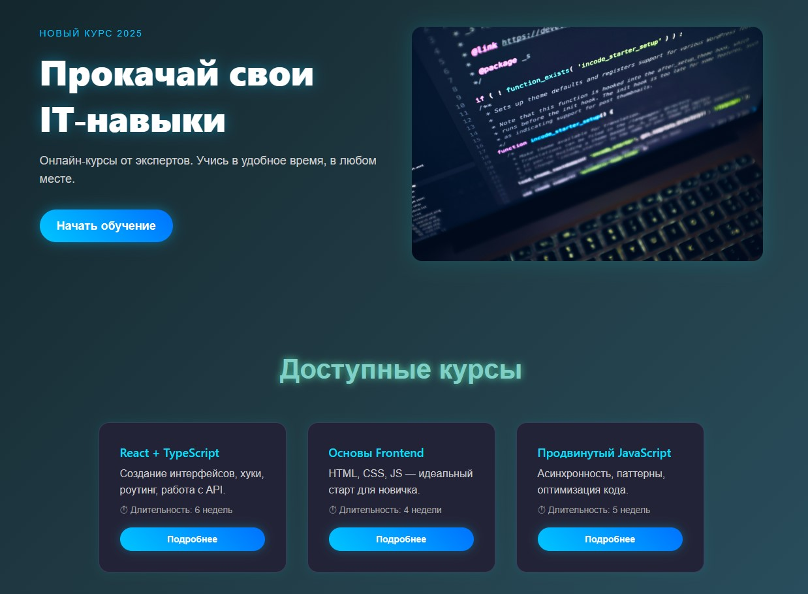

# CodeBoost — Лендинг онлайн-курсов

Современный лендинг для образовательного проекта CodeBoost, оформленный в футуристичном стиле. Сайт презентует платформу онлайн-обучения, рассказывает о курсах, преимуществах, тарифах и содержит форму обратной связи.



## 🚀 Стек технологий

- **React + TypeScript** — компонентный подход, маршрутизация, типизация
- **Mantine UI** — современная библиотека компонентов
- **Custom CSS** — глобальные стили, карточки, анимации
- **Vite** — быстрая сборка и разработка

## 🎨 Дизайн и особенности

- Проект разработан по принципу **mobile-first**, поэтому дизайн минималистичен и фокусируется на читаемости и скорости

- Единый стиль с неоновой подсветкой и градиентным фоном

- Реализация секций: Hero, Courses, Features, Pricing, Testimonials, Contact, Footer

- Адаптивная сетка и стили

- Отдельные CSS-модули: `base.css`, `typography.css`, `cards.css`, `animations.css`

## 📁 Структура проекта

```
public/
  images/
    hero.jpg

src/
  components/
  sections/
  styles/
  App.tsx
  main.tsx

index.html
package.json
vite.config.ts
```

## 📦 Установка и запуск

```bash
npm install
npm run dev
```

Открой в браузере по адресу `http://localhost:5173`

## 📌 Планы на будущее

- Интеграция с бэкендом для обработки формы
- Реальная маршрутизация (React Router)
- CMS или Markdown для контента курсов
- SEO-оптимизация и Open Graph

## 🔗 Автор

Сайт создан как часть портфолио frontend-разработчика:
**[AlexSavOne](https://github.com/AlexSavOne)**
